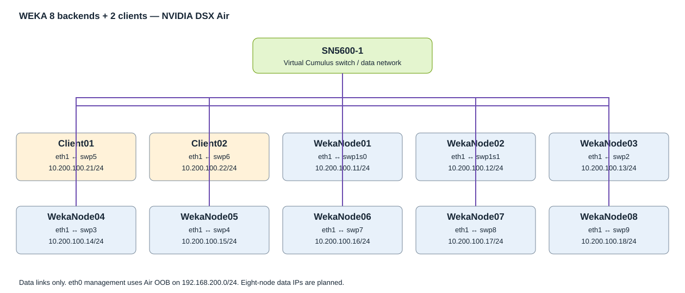

# WEKA Demo for NVIDIA DSX Air

A practical WEKA filesystem lab with **five- and eight-backend topologies**, two clients, and one virtual Cumulus switch. Start with the working five-node reference, then use the eight-node commissioning guide when sufficient Air resources are available.



## Choose a lab

| Lab | Current state | Guide | Air topology |
| --- | --- | --- | --- |
| Five backends + two clients + one switch | Working reference reported; five drives UP, I/O STARTED, two clients connected | [Five-node guide](labs/5node/README.md) | [topology.json](labs/5node/topology.json) |
| Eight backends + two clients + one switch | JSON imported; deployment blocked by memory quota; validation pending | [Eight-node guide](labs/8node/README.md) | [topology.json](labs/8node/topology.json) |

**Importing JSON creates the topology only.** It does not install WEKA, restore scripts, configure the data switch, or initialize a cluster. There is no ZTP provisioning payload. A saved working simulation/checkpoint is required for a preconfigured demonstration.

## Setup guide

1. Download the selected topology JSON and import it into NVIDIA DSX Air with OOB enabled and ZTP disabled.
2. Check available resources before starting. The eight-node JSON allocates 58 vCPUs and 212 GiB RAM; Air reported 218 GiB including overhead. The five-node JSON allocates 40 vCPUs and 140 GiB RAM, before Air overhead. Preserving both labs may require a quota increase.
3. Start the simulation and wait for ACTIVE and node console logins. Boot time has not been measured.
4. Use Air consoles for initial access. Ubuntu console default shown by Air is `ubuntu` / `nvidia` if unchanged. For the switch, consult its node credential panel. The reference external OOB SSH service currently rejects the tested keys; do not assume it works.
5. From WekaNode01 or the OOB server, collect baseline evidence:

```bash
bash 0_preflight.sh --lab 5node
```

6. Review the generated host network settings. Only for a new lab after checking the switch and existing Netplan files:

```bash
bash 1_setup_data_network.sh --lab 8node
# Review the preview first; use --apply only when ready.
bash 1_setup_data_network.sh --lab 8node --apply
```

7. Install the approved WEKA release on every backend/client and complete the cluster commissioning described in the selected guide. The five-node reference script assumes WEKA is already installed and wipes disks; read its reference notes before any reuse. An eight-node rebuild has not been validated.
8. Inspect the established cluster and client mounts:

```bash
bash 2_validate_lab.sh --lab 5node
```

9. Follow the cross-client file check in the lab guide. Preview, then optionally run the short I/O test:

```bash
bash 3_fio_smoke_test.sh --lab 5node
bash 3_fio_smoke_test.sh --lab 5node --run
```

10. Capture outputs and preserve a completed Air checkpoint. Exporting the topology does not preserve installed software or cluster data.

## Naming and IPs

| Role | Names | Management eth0 | Data eth1 |
| --- | --- | --- | --- |
| Backend | WekaNode01–05 or WekaNode01–08 | 192.168.200.11–15 or .11–18 | 10.200.100.11–15 or .11–18 /24 |
| Client | Client01, Client02 | 192.168.200.21–22 | 10.200.100.21–22 /24 |
| Switch | SN5600-1 | 192.168.200.3 | Layer 2 forwarding; actual bridge/VLAN to verify |

Per-lab port maps and host Netplan fragments are in each lab directory. The source switch image is `cumulus-vx-5.16.1`, and Ubuntu image is `generic/ubuntu2204`. UDP networking and emulated NVMe make this a functional demo, not a hardware throughput or RDMA test.

## Repository contents

| Path | Purpose |
| --- | --- |
| `labs/5node/`, `labs/8node/` | Guides, topologies, inventories, storage.5/storage.8 IP lists, port maps, host Netplan snippets, diagrams |
| `0_preflight.sh`–`3_fio_smoke_test.sh` | Numbered practical helpers with previews for write operations |
| `scripts/air_lab.py` | Shared Python helper implementation |
| `scripts/check_repository.py` | Local topology, inventory, link, and asset consistency checks |
| `reference/5node/` | Original destructive rebuild script retained as text |
| `docs/validation-record.md` | Observed results and pending checks |
| `docs/script-guide.md` | Helper behavior and limitations |
| `docs/publishing.md` | Private GitHub publishing instructions |
| `assets/` | README topology illustration |

## Validation and troubleshooting

The reference five-node cluster reported WEKA 5.1.0.605, 3+2 fully protected, five drives UP, two clients connected, and a fio write excerpt of 63.4 MiB/s. It also reported Unlicensed and three active alerts that still need review. Eight-node results are pending. See the [validation record](docs/validation-record.md) and per-lab troubleshooting sections.

Check repository consistency locally:

```bash
python3 scripts/check_repository.py
```

This validates the package structure, not a running WEKA deployment. No helper installs a WEKA license or binary, changes the switch, or silently wipes drives.

## Resuming a saved simulation

Start the saved simulation/checkpoint, wait for console access, and run preflight plus validation for its lab size. Check current data addresses and mounts before changing networking. Do not rerun the destructive rebuild as a resume command.

## Publishing

Proposed name: `weka-dsx-air-demo`. Use the [publishing instructions](docs/publishing.md) to create a private GitHub repo from this package. A live GitHub repo has not been created yet. License/ownership terms have not been assigned automatically.

## References and contact

- [NVIDIA DSX Air](https://dsx-air.nvidia.com/)
- [NVIDIA DSX Air Quick Start](https://docs.nvidia.com/networking-ethernet-software/nvidia-air/Quick-Start/)
- Structural reference: `githedgehog/nvidia-air-demo` on GitHub. This repository uses the same general guide/topology/assets/numbered-scripts organization; no Hedgehog source code was copied.
- Lab owner: Chandra Sekhar Gonuguntla (Sekhar). Use the approved WEKA support channel and Air organization administrator for assistance.
