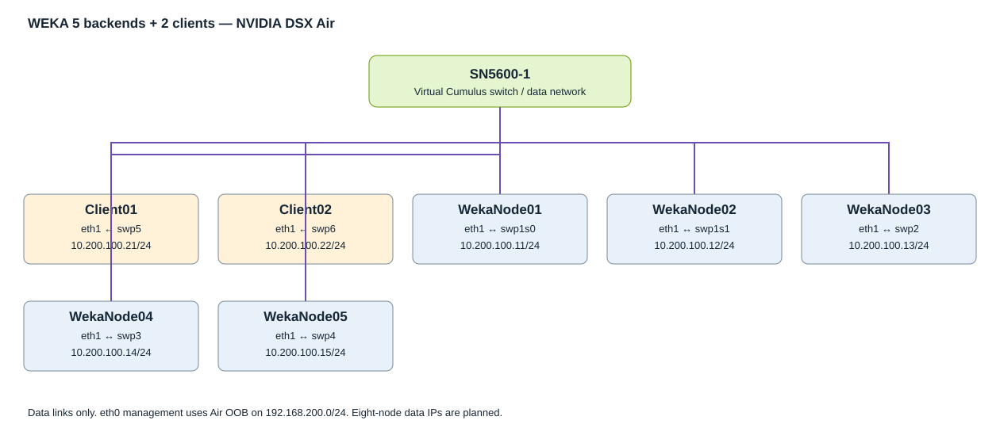

<!-- AIR:tour -->

# WEKA 5-Backend, 2-Client Lab in NVIDIA DSX Air

WEKA provides a shared filesystem that clients access through a distributed storage cluster. This lab lets a platform or storage engineer inspect backend health, verify client mounts, and demonstrate file sharing and basic I/O over a virtual Ethernet network.

This guide demonstrates an existing working WEKA cluster. Restore the saved working simulation/checkpoint before following the validation flow. Importing the JSON alone creates Ubuntu VMs and virtual disks; it does not restore installed WEKA software or cluster state.

**Status as of October 1, 2026:** Validated working reference lab. Five backend containers and five drives are UP, I/O is STARTED, and two clients are connected. Three alerts and an Unlicensed state remain to be reviewed.

**Important:** This is a functional virtual lab using UDP and emulated NVMe devices. Its fio results describe this simulation only; they are not production performance measurements or a hardware/RDMA validation. Preserve the working five-node reference before any rebuild.

## Table of Contents

- [Lab Story and Scenario](#lab-story-and-scenario)
- [Features and Services](#features-and-services)
- [What You Will Do in This Lab](#what-you-will-do-in-this-lab)
- [Demo Topology Overview](#demo-topology-overview)
- [Demo Topology Information](#demo-topology-information)
- [Demo Environment Access](#demo-environment-access)
- [Lab Flow](#lab-flow)
- [Validation Summary](#validation-summary)
- [Troubleshooting, Upgrade, or Reset](#troubleshooting-upgrade-or-reset)
- [References](#references)
- [Contact Info](#contact-info)

## Lab Story and Scenario

You are a platform engineer checking whether two application hosts can use the same WEKA filesystem. First establish that management access and the data network work. Then inspect the storage cluster and client mounts, write a small file from Client01, read it from Client02, and run a short fio workload. Successful shared-file access and healthy cluster state establish the functional result.

## Features and Services

- 5 Ubuntu WEKA backend VMs, each with a 48 GB emulated NVMe data disk and an 8 GB emulated NVMe swap disk.
- Two Ubuntu clients using the native WEKA filesystem mount at `/mnt/weka`.
- One virtual Cumulus switch labeled SN5600, with one data link per server/client.
- Air OOB management for consoles and jump-server access.
- Reference WEKA version: 5.1.0.605; dedicated deployment and UDP networking.

## What You Will Do in This Lab

- Identify node roles, management addresses, and data connections.
- Check network reachability and jumbo-frame paths.
- Verify backend containers, drives, I/O, protection, and clients.
- Demonstrate cross-client file access and run a short functional fio test.
- Capture evidence and preserve a checkpoint for later use.

<!-- AIR:page -->

## Demo Topology Overview

All backend and client `eth1` interfaces connect to SN5600-1. `eth0` interfaces use the separate Air OOB management network. The Air-managed `oob-mgmt-server` is additional infrastructure; it is not included in the explicit 8-node JSON count.



### Device Naming

`WekaNode01` through `WekaNode05` are storage backends. `Client01` and `Client02` are filesystem consumers. `SN5600-1` is the data switch. Hostname capitalization may appear differently in terminal prompts; compare actual `hostname` output.

### Devices

| Role | Device names | Image/settings from JSON |
| --- | --- | --- |
| Backend | WekaNode01–WekaNode05 | generic/ubuntu2204; 6 vCPU; 24 GiB RAM; 32 GB boot disk; host-passthrough CPU |
| Client | Client01, Client02 | generic/ubuntu2204; 4 vCPU; 8 GiB RAM; 20 GB boot disk; host-passthrough CPU |
| Data switch | SN5600-1 | cumulus-vx-5.16.1; 2 vCPU; 4 GiB RAM; 20 GB boot disk |
| Management | oob-mgmt-server | Air-managed; address and resources not supplied in JSON |

The switch image above is the uploaded topology image, not an observed running switch version. Verify it in the simulation. A virtual switch labeled SN5600 does not emulate physical ASIC performance.

<!-- AIR:page -->

## Demo Topology Information

### IPAM

| Hostname | Interface | IP address | Evidence/status |
| --- | --- | --- | --- |
| Client01 | eth0 | 192.168.200.21/24 | JSON management assignment |
| Client01 | eth1 | 10.200.100.21/24 | Observed/configured reference |
| Client02 | eth0 | 192.168.200.22/24 | JSON management assignment |
| Client02 | eth1 | 10.200.100.22/24 | Observed/configured reference |
| SN5600-1 | eth0 | 192.168.200.3/24 | JSON management assignment |
| WekaNode01 | eth0 | 192.168.200.11/24 | JSON management assignment |
| WekaNode01 | eth1 | 10.200.100.11/24 | Observed/configured reference |
| WekaNode02 | eth0 | 192.168.200.12/24 | JSON management assignment |
| WekaNode02 | eth1 | 10.200.100.12/24 | Observed/configured reference |
| WekaNode03 | eth0 | 192.168.200.13/24 | JSON management assignment |
| WekaNode03 | eth1 | 10.200.100.13/24 | Observed/configured reference |
| WekaNode04 | eth0 | 192.168.200.14/24 | JSON management assignment |
| WekaNode04 | eth1 | 10.200.100.14/24 | Observed/configured reference |
| WekaNode05 | eth0 | 192.168.200.15/24 | JSON management assignment |
| WekaNode05 | eth1 | 10.200.100.15/24 | Observed/configured reference |

Management and data interfaces are separate networks. Linux server VRFs are not explicitly configured by this JSON. The switch VLAN ID, bridge name, and VRF must be verified from the running switch; they were not supplied in the reference output. Do not assume a VLAN ID.

### Physical Connectivity

These are virtual data links copied from the topology JSON.

| Hostname | Local port | Remote port | Remote device |
| --- | --- | --- | --- |
| Client01 | eth1 | swp5 | SN5600-1 |
| Client02 | eth1 | swp6 | SN5600-1 |
| WekaNode01 | eth1 | swp1s0 | SN5600-1 |
| WekaNode02 | eth1 | swp1s1 | SN5600-1 |
| WekaNode03 | eth1 | swp2 | SN5600-1 |
| WekaNode04 | eth1 | swp3 | SN5600-1 |
| WekaNode05 | eth1 | swp4 | SN5600-1 |

Existing breakout-style interface names `swp1s0` and `swp1s1` are preserved. Eight-node additions use swp7–9. Any switch configuration for the new lab must include those ports.

### Resource Requirements

| Resource | Explicit JSON allocation |
| --- | ---: |
| vCPUs | 40 |
| RAM | 140 GiB |
| Virtual disks, including boot/data/swap | 500 GB |

Air adds management infrastructure and overhead. The organization dashboard showed 146 GB in use while the five-node lab was active; this is an observation, not a guaranteed per-lab allocation.

## Demo Environment Access

### Load Time and Readiness

Boot time has not been measured. Wait for the simulation to show ACTIVE and each node console to present a login prompt. Login readiness does not prove WEKA readiness: continue with the checks below. If boot returns to INACTIVE, inspect History before changing the topology.

### Console Access

Use the Nodes or Topology tab to open the desired node console. Console access is the baseline path and does not require working external SSH keys.

### Device Credentials

| Device | Username | Password/access | Management address |
| --- | --- | --- | --- |
| Ubuntu backends | ubuntu | Air console showed default `nvidia`; use changed lab password if applicable | 192.168.200.11–15 |
| Ubuntu clients | ubuntu | Air Ubuntu default `nvidia`; verify for the selected node | 192.168.200.21–22 |
| SN5600-1 | cumulus | Template default `Cumu1usLinux!`; not verified in this lab; consult node credential panel | 192.168.200.3 |
| oob-mgmt-server | ubuntu | Consult node console credentials; external SSH requires an authorized key | Discover in console |

### SSH Access

In the reference simulation, Services > Enable SSH exposed the OOB server, not WekaNode01. New Service offered only `oob-mgmt-server:eth0`. External hostname and port are simulation-specific; copy them from the current Services row rather than reusing an old endpoint. Both tested Mac keys were rejected with `Permission denied (publickey)`; external SSH has not been validated.

Once logged into the OOB console, use backend management SSH. Backend username is `ubuntu`; enter its current password (Air default `nvidia` if unchanged).

```console
ubuntu@oob-mgmt-server:~$ ssh ubuntu@192.168.200.11
ubuntu@WekaNode01:~$ hostname
WekaNode01
```

Use hostname SSH only after confirming name resolution. For the switch, use `cumulus` and the password shown in its console credential panel:

```console
ubuntu@oob-mgmt-server:~$ ssh cumulus@192.168.200.3
cumulus@SN5600-1:~$ hostname
```

Commands below include prompts to identify execution context, following the supplied guide format. Copy the text after `$`; do not paste the prompt itself.

<!-- AIR:page -->

## Lab Flow

### Step 1. Inspect Backend Readiness

**Goal:** Confirm the right VM, IPs, resources, and software.

**Access needed:** WekaNode01 console. **Credentials:** `ubuntu`, current lab password (default `nvidia` if unchanged). **Expected wait:** Usually interactive; command timing has not been measured.

```console
ubuntu@WekaNode01:~$ hostname
ubuntu@WekaNode01:~$ ip -br a
ubuntu@WekaNode01:~$ free -h
ubuntu@WekaNode01:~$ lsblk -o NAME,SIZE,TYPE,MOUNTPOINTS
ubuntu@WekaNode01:~$ command -v weka
ubuntu@WekaNode01:~$ weka version
```

Expected result: WekaNode01, eth0 192.168.200.11/24, eth1 10.200.100.11/24 after configuration, roughly 24 GiB allocated memory, a 32 GB boot device, and separate 48 GB/8 GB NVMe devices. Linux may display disk capacity in GiB. The reference active WEKA version is 5.1.0.605; repeat version and disk checks on every backend and client before commissioning.

Validation: compare interfaces with IPAM and inspect device sizes/serials rather than relying on device numbering.

### Step 2. Verify the Data Network and Switch

**Goal:** Verify reachability before investigating storage.

**Access needed:** WekaNode01 console (`ubuntu`, current password; default `nvidia` if unchanged). Switch console (`cumulus`, credential-panel password). **Expected wait:** About two seconds per two-packet ping plus any timeout.

```console
ubuntu@WekaNode01:~$ for ip in 10.200.100.11 10.200.100.12 10.200.100.13 10.200.100.14 10.200.100.15 10.200.100.21 10.200.100.22; do ping -I eth1 -c 2 -W 2 "$ip" || break; done
ubuntu@WekaNode01:~$ ping -I eth1 -M do -s 8972 -c 3 10.200.100.21
cumulus@SN5600-1:~$ ip -br link
cumulus@SN5600-1:~$ bridge link show
cumulus@SN5600-1:~$ bridge vlan show
```

Expected result: replies from each host; jumbo packets succeed only when the whole path supports the intended 9000-byte IP MTU. The supplied five-node log confirmed ordinary pings to all seven hosts; it did not capture a jumbo-frame test or switch configuration.

Validation: compare switch interfaces with the connectivity table and confirm forwarding membership. A failed jumbo test with successful small pings suggests an MTU/path issue to investigate, not proof of a WEKA fault.

### Step 3. Inspect Cluster Health

**Goal:** Establish storage readiness and inspect unresolved alerts.

**Access needed:** WekaNode01 console. **Credentials:** `ubuntu`, current password (default `nvidia` if unchanged); existing WEKA CLI authorization where required. **Expected wait:** Interactive; no measured duration.

```console
ubuntu@WekaNode01:~$ weka status
ubuntu@WekaNode01:~$ weka cluster drive
ubuntu@WekaNode01:~$ weka fs
ubuntu@WekaNode01:~$ weka alerts
ubuntu@WekaNode01:~$ sudo weka local ps
```

Expected result: 5 backend containers UP, 5 drives UP, I/O STARTED, and two clients connected. The captured five-node result reported 3+2 fully protected, one failure-domain hot spare, 95.17 GiB total drive storage, 75.17 GiB unprovisioned, Unlicensed, and three active alerts. Do not treat the OK headline as resolution of those alerts.

Validation: capture the complete outputs and review alerts before claiming readiness. The reference log's earlier STOPPING_BUCKETS state preceded teardown; the later successful rebuild superseded it.

### Step 4. Confirm Client Mounts and Shared File Access

**Goal:** Prove both clients see the same filesystem.

**Access needed:** Client01 and Client02 consoles. **Credentials for each:** `ubuntu`, current lab password (default `nvidia` if unchanged). **Expected wait:** A few interactive commands; not measured.

The supplied client setup script mounts with `net=udp,num_cores=0,mgmt_ip=<client-data-IP>` and backend endpoint `10.200.100.11/default`. This is reference configuration, not a command to reset an already-mounted client.

First inspect both client mounts:

```console
ubuntu@Client01:~$ findmnt -T /mnt/weka
ubuntu@Client01:~$ df -hT /mnt/weka
ubuntu@Client02:~$ findmnt -T /mnt/weka
ubuntu@Client02:~$ df -hT /mnt/weka
```

Confirm the reported filesystem type is `wekafs`. If `/mnt/weka` resolves to the Ubuntu root filesystem, stop; a directory existing is not evidence of a WEKA mount.

Write and read a small demonstration file:

```console
ubuntu@Client01:~$ test "$(findmnt -n -o FSTYPE -T /mnt/weka)" = wekafs && mkdir -p /mnt/weka/air-lab-validation && printf 'WEKA shared-file check from Client01\n' > /mnt/weka/air-lab-validation/client01-check.txt
ubuntu@Client02:~$ test "$(findmnt -n -o FSTYPE -T /mnt/weka)" = wekafs && cat /mnt/weka/air-lab-validation/client01-check.txt
WEKA shared-file check from Client01
```

Expected result: Client02 reads the exact line written by Client01. This check has not been captured in the supplied evidence; execute it and retain the output.

### Step 5. Run a Short Functional I/O Test

**Goal:** Generate bounded test traffic on the mounted filesystem.

**Access needed:** Client01 console, then Client02 if desired. **Credentials:** `ubuntu`, current password (default `nvidia` if unchanged). **Expected wait:** Approximately 30 seconds plus file setup/flush time per run. Confirm several GiB of free space and installed `fio` first.

```console
ubuntu@Client01:~$ command -v fio
ubuntu@Client01:~$ test "$(findmnt -n -o FSTYPE -T /mnt/weka)" = wekafs && mkdir -p /mnt/weka/air-lab-validation/fio-client01 && fio --name=air-client01-write --directory=/mnt/weka/air-lab-validation/fio-client01 --rw=write --bs=1M --size=2G --numjobs=2 --iodepth=8 --ioengine=libaio --direct=1 --runtime=30 --time_based --group_reporting
```

Use a separate `fio-client02` directory and job name if testing Client02. Expected result: fio completes without I/O errors and prints WRITE bandwidth. A time-based run can write more cumulative data than its allocated file size. Do not overwrite application files or run a production workload here.

The supplied reference result was WRITE 63.4 MiB/s (66.5 MB/s), 1,918 MiB transferred, and roughly 30.3 seconds runtime. The excerpt did not identify the client or demonstrate simultaneous aggregate throughput. Performance varies with Air host load and virtual resources.

Validation: retain the fio output and recheck `weka status`. Idle reads/writes after fio finishes are expected.

### Step 6. Capture Evidence and Preserve the Lab

**Goal:** Retain working scripts and validation records before changing simulations.

**Access needed:** WekaNode01 console and Air Checkpoints tab. **Credentials:** `ubuntu`, current password (default `nvidia` if unchanged). **Expected wait:** Checkpoint duration is not measured; wait for the UI to confirm completion.

```console
ubuntu@WekaNode01:~$ weka status
ubuntu@WekaNode01:~$ weka cluster drive
ubuntu@WekaNode01:~$ weka fs
ubuntu@WekaNode01:~$ weka alerts
ubuntu@WekaNode01:~$ ls -l ~/*.sh
```

For the existing five-node home directory, archive the known scripts and storage file:

```console
ubuntu@WekaNode01:~$ cd ~
ubuntu@WekaNode01:~$ tar -czvf weka-scripts-backup.tar.gz -- *.sh *.sh.bak storage.5
ubuntu@WekaNode01:~$ tar -tzf weka-scripts-backup.tar.gz
ubuntu@WekaNode01:~$ sha256sum weka-scripts-backup.tar.gz
```

The reference archive contains six `.sh` files, one `.sh.bak`, and `storage.5`. New eight-node filenames will differ; review the actual directory before selecting files. A script archive does not contain WEKA binaries, switch configuration, cluster data, or a complete VM backup.

Create a named checkpoint in Air and verify its completed state. A successful checkpoint has not yet been reported for either lab. Export the topology separately; JSON export does not substitute for a saved working state.

<!-- AIR:page -->

## Validation Summary

| Check | Acceptance condition | Current evidence |
| --- | --- | --- |
| Backend containers | 5 UP | Observed: 5 UP |
| Drives | 5 UP | Observed: 5 UP |
| I/O | STARTED | Observed |
| Protection | Reported fully protected | Observed: 3+2 |
| Clients | 2 connected, wekafs mounted | 2 connected observed; mount inspection to capture |
| Shared file | Client02 reads Client01 file | Not yet captured |
| Jumbo path | 8972-byte ICMP payload succeeds | Not yet captured |
| fio | Completes with no I/O errors | Write result captured: 63.4 MiB/s; full output to retain |
| Alerts/license | Reviewed and documented | 3 alerts; Unlicensed observed; review pending |
| Checkpoint | Completed checkpoint retained | Not yet confirmed |

## Troubleshooting, Upgrade, or Reset

### Air Launch Fails

Read History for a resource quota error. Stop/suspend only simulations you own or are authorized to manage after preserving their working state, or request an organization quota increase. Do not delete the reference lab to resolve a temporary memory shortage.

### SSH Returns Permission Denied (publickey)

The reference external OOB SSH endpoint rejected both tested Mac keys. Confirm the authorized public key and the correct local private key. Do not assume the Ubuntu console password enables external OOB SSH. Changing to a root shell on the Mac changes its SSH home and key lookup. Use Air consoles until access is resolved.

### No Data Address or Network Reachability

Use `ip -br a` and inspect effective Netplan configuration on the affected node. In the reference rebuild log, immediate post-Netplan interface output temporarily lacked IPv4 addresses, while subsequent pings succeeded. Inspect current state before concluding addresses were lost. Preserve eth0 management and verify switch forwarding/MTU before rerunning network changes.

### Container Startup or I/O Stalls

On WekaNode01, login as `ubuntu` with its current password (default `nvidia` if unchanged). Capture read-only evidence:

```console
ubuntu@WekaNode01:~$ sudo weka local ps
ubuntu@WekaNode01:~$ weka status
ubuntu@WekaNode01:~$ weka alerts
ubuntu@WekaNode01:~$ free -h
ubuntu@WekaNode01:~$ swapon --show
ubuntu@WekaNode01:~$ lsblk -o NAME,SIZE,TYPE,MOUNTPOINTS
```

Use installed CLI help to select supported logging commands. Do not treat a single 'Waiting for container to start up' line as proof of a permanent failure; capture current state and logs.

### Rebuild, Upgrade, and Reset

`rebuild_5backend_2client_udp.sh` and `clean_teardown_dsx_weka.sh` remove containers and wipe backend disks. They are destructive lab recovery workflows, not health checks, and the five-node script must not be run as an eight-node deployment. The reference script also assumes existing WEKA installation, fixed disk numbering, and container IDs 0–4. Review and adapt those assumptions before use. Avoid suppressing errors in provisioning steps; record failures and verify readiness before proceeding.

No eight-node upgrade/reset workflow has been validated. Preserve a checkpoint and collect diagnostics before planning a reset or changing versions.

## References

- [NVIDIA DSX Air Quick Start](https://docs.nvidia.com/networking-ethernet-software/nvidia-air/Quick-Start/)
- [NVIDIA DSX Air](https://dsx-air.nvidia.com/)
- WEKA deployment and CLI documentation for the approved installed release (partner resource title; no external live link).
- Source evidence: supplied five-backend topology JSON, five-node rebuild transcript, successful `weka status`/fio excerpt, and Air quota/Services screenshots.

## Contact Info

| Contact type | Details |
| --- | --- |
| Lab owner | Chandra Sekhar Gonuguntla (Sekhar) |
| Air resources | Organization administrator; David is the current resource-request contact |
| WEKA support | Existing approved WEKA support channel for this lab |
| Publication | Approved NVIDIA-hosted repository/location to be supplied by the publishing owner |

## Publication Readiness

This guide is based on session evidence and has not been executed end to end by the authoring assistant. Keep pending checks visible until completed. Verify node credentials, actual switch version/configuration, approved software/licensing, boot timing, checkpoint recovery, and all validation outputs before publishing as a finished demo. Include the relative `images/` assets with the Markdown in the same repository change. The supplied template's restriction to NVIDIA-owned live links is preserved. No Git repository was created or published by this document-generation task.
