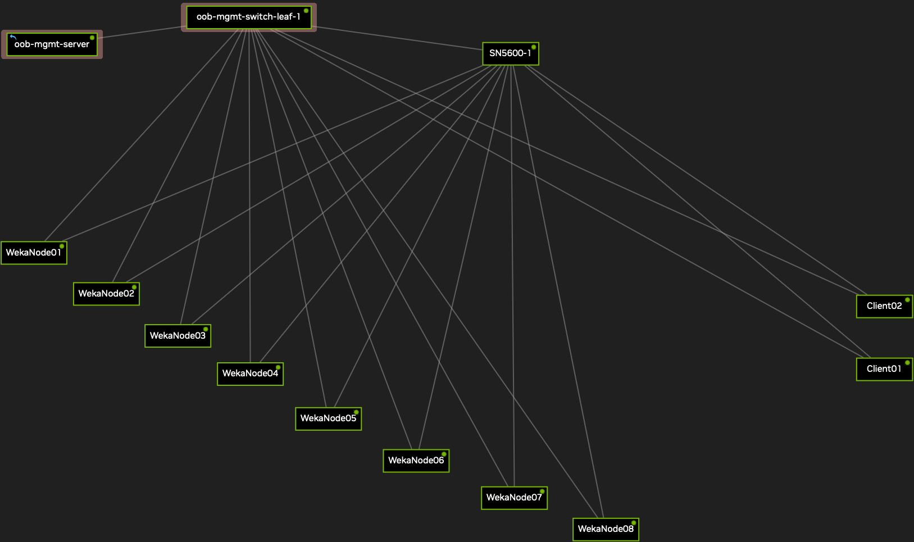

# Eight-backend WEKA DSX Air lab



## Topology and prerequisites

| Hosts | Management eth0 | Data eth1 | Resources |
|---|---|---|---|
| WekaNode01–08 | 192.168.200.11–18 | 10.200.100.11–18 | 6 vCPU, 24 GiB RAM each; 48 GB data NVMe and 8 GB swap NVMe |
| Client01–02 | 192.168.200.21–22 | 10.200.100.21–22 | 4 vCPU, 8 GiB RAM each |
| SN5600-1 | 192.168.200.3 | L2 access VLAN 100 | Cumulus switch |

Air adds the OOB management network. Data interfaces use /24 addressing and MTU 9000. See [port map](port-map.csv), [topology JSON](topology.json), and [Netplan fragments](config/netplan/).

This workflow starts from a prepared simulation or clean checkpoint: WEKA 5.1.34 installed on all ten hosts, working switch/data network, and passwordless SSH plus passwordless sudo from ubuntu on WekaNode01 to all ten management addresses. Software installation and switch setup are prerequisites, not performed by the cluster creation script. Obtain software and credentials through the lab owner; no installer token is provided here.

Data disk serials are weka01–weka08; swap serials are swap01–swap08. The creation script expects data at /dev/nvme0n1 and swap at /dev/nvme1n1. Inspect lsblk after each checkpoint launch; if numbering differs, stop and review the script. Reset finds disks by serial because active WEKA can bind the data controllers to igb_uio, hiding the Linux block devices.

## Copy scripts

Copy the files from this repository's scripts directory to the home directory of ubuntu on WekaNode01. Copy 05_oob_gui_service.sh separately to ubuntu on oob-mgmt-server. Do not run backend scripts on the OOB server.

## 1. Create cluster and filesystem

Run as ubuntu on WekaNode01 in an unconfigured simulation:

```bash
bash ~/01_create_cluster.sh
weka status
weka cluster drive
weka fs
```

The script validates all hosts, initializes blank swap if needed, creates three-core/4 GiB UDP backend containers with separate failure domains, discovers actual container IDs, adds drives, sets 5+2 protection and one hot-spare failure domain, and creates group1/default with size 80 GiB. Active swap is permitted. It refuses an existing cluster or unexpected containers/disk signatures.

Expected: eight backends and eight drives UP, fully protected, I/O STARTED, and default filesystem present. Do not rerun blindly after a partial failure; inspect the timestamped build log.

## 2. Mount clients

```bash
bash ~/02_mount_clients.sh
PDSH_RCMD_TYPE=ssh pdsh -l ubuntu -w '192.168.200.[21-22]' \
  'hostname; findmnt --mountpoint /mnt/weka; df -h /mnt/weka'
```

Both clients mount 10.200.100.11/default at /mnt/weka using net=udp,num_cores=0 and their own data management IP. Mounts are session mounts; no automatic remount entry is created.

## 3. Write and read verification

```bash
bash ~/03_fio_write_read.sh
```

Each client writes a separate 1 GiB file using 1 MiB blocks, libaio, direct I/O and CRC32C verification metadata. Each client then reads and verifies the other client's file. Results are saved in timestamped local logs; test files remain in a unique shared directory. Report actual results, not fixed or summed throughput.

## 4. GUI through OOB

Run on oob-mgmt-server:

```bash
bash ~/05_oob_gui_service.sh
```

If the management IP cannot reach WEKA, run this optional relay on WekaNode01:

```bash
bash ~/05b_node01_gui_relay.sh
```

Then on OOB:

```bash
BACKEND_PORT=14001 bash ~/05_oob_gui_service.sh
```

In the new simulation's Air Services, add:

| Field | Value |
|---|---|
| Name | weka-gui |
| Interface | oob-mgmt-server:eth0 |
| Type | HTTPS |
| Service Port | 14000 |

Open the HTTPS URL assigned by Air, whose external port may differ from 14000. The relay preserves WEKA TLS. Use the cluster's current credentials; a self-signed certificate may require the user to acknowledge the browser warning.

Direct Air service access to WekaNode01:eth0 works only if https://192.168.200.11:14000 responds from OOB. A Mac outside the simulation cannot access the private lab IPs without a routed connection. Port mapping or a tunnel is necessary for external browser access.

## 5. Unmount

```bash
bash ~/04_unmount_clients.sh
# Optional: also stop named client containers after both mounts are gone.
bash ~/04_unmount_clients.sh --stop-client
```

This does not delete stored data. Busy mounts abort; no forced or lazy unmount is used.

## 6. Teardown and clean checkpoint

This deletes cluster data in the selected simulation. Run on its WekaNode01:

```bash
bash ~/00_teardown.sh --plan
bash ~/00_teardown.sh --apply
```

No cluster UUID or WEKA user login is required. The script checks host names/software/known containers, unmounts clients, force-stops and removes default/client containers, then verifies all eight returned data disks by serial before zeroing any disk. Whole-disk readback verifies zeroing. Root disks and swap remain configured. If a disk does not return to Linux, reset aborts before wiping; retain the log and investigate driver state.

Require eight disk PASS messages and RESET COMPLETE. Only then create the Air checkpoint WEKA-5.1.34-8Backend-Clean-Ready, before rebuilding. Include scripts and networking on the checkpoint's root disks. If using Marketplace, select this clean checkpoint and include documentation directly in the demo when viewers cannot access the private GitHub repo.

Launch a new simulation from the checkpoint, verify disks/network/container state, then run creation, mount and fio scripts in order. Configure or verify GUI service access for that new simulation. Each new cluster receives its own UUID.

A checkpoint of the running configured cluster previously restored with failed/unknown drives. Additional NVMe persistence and consistent running-cluster restore have not been established; the clean-start workflow avoids relying on restoration of existing WEKA data.
